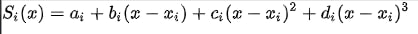
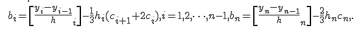
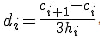
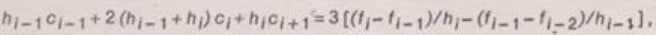
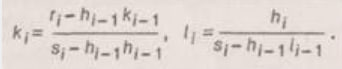
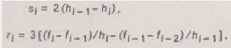
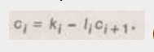
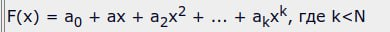
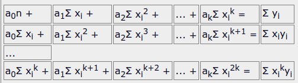

## Интерполяция таблично заданных функций методом кубических сплайнов
Кубический сплайн — гладкая функция, область определения которой разбита на конечное число отрезков, на каждом из которых она совпадает с некоторым кубическим многочленом (полиномом)

Нужно найти коэффициенты A B C D

Т.к. имеются условия, которым должен удовлетворять кубический сплайн, то выводят формулы для вычисления коэффициентов:
 - Коэффициент А  

 - Коэффициент B  

 - Коэффициент D  

 - Коэффициент C  

Где hi = xi - xi-1

Если учесть, что C0 = Cn = 0, то вычисление коэффициента C можно провести с помощью метода прогонки для трёхдиагональной матрицы.

Сначала нужно рассчитать прогоночные коэффициенты.  
Выводятся следующие формулы для прогоночных коэффициентов.

Где к и l- прогоночные коэффициенты

Вычислив прогоночные коэффициенты можно вычислить коэффициенты С

Вычислив коэффициенты С можно вычислить остальные коэффициенты.

http://nickolay.info/algorithms/pas_ispline.html

http://www.machinelearning.ru/wiki/index.php?title=Интерполяция_кубическими_сплайнами

## Аппроксимация функций полиномом методом наименьших квадратов.
Требуется определить параметры ai многочлена вида

Путем математической магии все сводится к тому, что нужно составить и решить следующую SLE:

Получив все коэффициенты, подставляем в функцию X и находим Y.